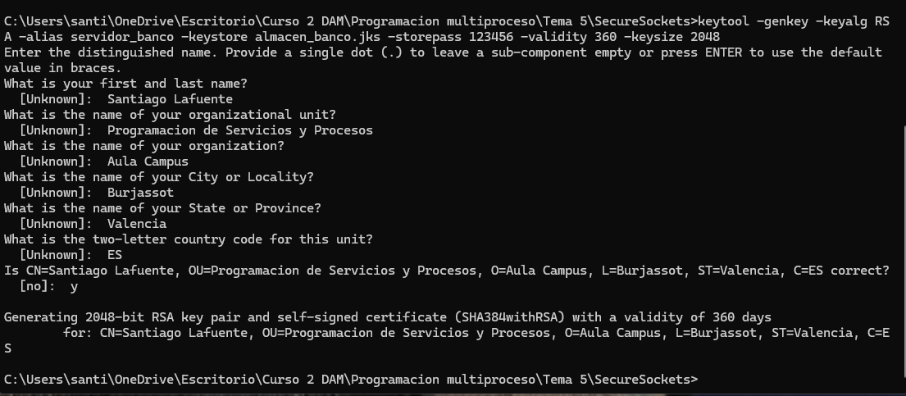

## 📅 Actividad Final: Comunicaciones Seguras (Sockets SSL)

Se ha implementado una arquitectura Cliente-Servidor segura utilizando el protocolo **SSL/TLS**. A diferencia de los sockets normales, aquí la información viaja cifrada por la red, protegiendo los datos económicos.

### 1. Infraestructura de Seguridad (PKI)
Para esta actividad, he actuado como Autoridad de Certificación (CA) generando mi propio certificado autofirmado:

* **Comando:** `keytool` (Java KeyTool).
* **Archivo generado:** `almacen_banco.jks`
* **Algoritmo:** RSA 2048 bits.
* **Propietario:** Santiago Lafuente 

### 2. Implementación Técnica
* **Servidor (`ServidorSSL`):** Utiliza `SSLServerSocketFactory`. Carga el almacén de claves (`javax.net.ssl.keyStore`) para autenticarse ante los clientes.
* **Cliente (`ClienteSSL`):** Utiliza `SSLSocketFactory`. Se ha configurado para confiar explícitamente en el certificado generado (`javax.net.ssl.trustStore`), permitiendo la conexión segura ("Handshake SSL") sin errores de validación.

### 3. Funcionalidad
El sistema realiza una conversión de divisas (Euros a Dólares/Libras) garantizando que ningún atacante en la red (Sniffer) pueda leer la cantidad enviada ni el resultado devuelto.

---
* Curso 2 DAM - Programación de Servicios y Procesos.*